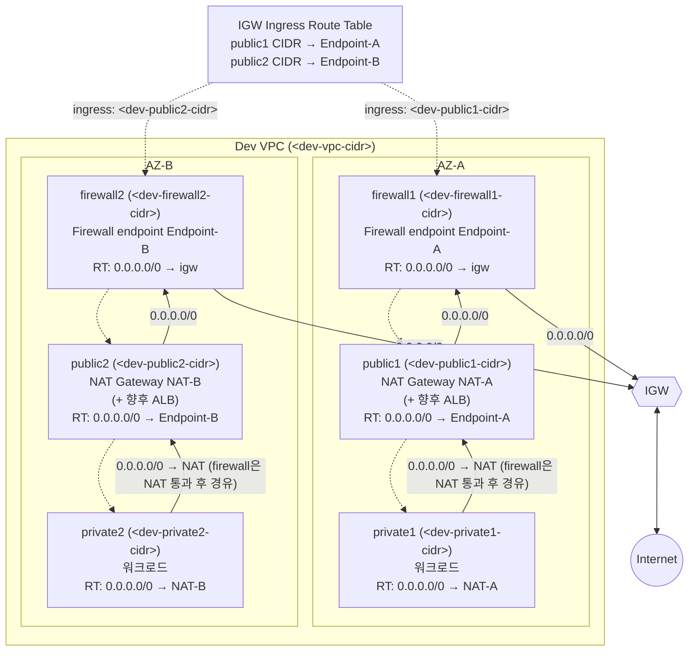

<h1>Dev 환경 네트워크 아키텍처 구축 실습보고서</h1>
<i>Dev Environment Network Firewall Diagnosis &amp; Rebuild</i>

*2026.07 · 클라우드 네트워크 보안 담당*

---

## 1. 요약
Dev VPC의 Network Firewall 아키텍처를 최초 진단부터 실제 재구축, 검증까지 전 과정을 기록한 문서다.
최초 진단 시점에는 private egress를 pre-NAT으로 검사하는 4-tier 구조였으나, 여러 단계의 실험과 재평가를 거쳐 ALB/NAT↔IGW 구간을 검사하는 3-tier 모델로 전면 재구축을 완료했다.
이 과정에서 정립된 구성이 회사 표준 아키텍처로 채택되었다.

---

## 2. 문서 정보
| 항목 | 내용 |
| --- | --- |
| 작성일 | 2026-07-07 (최초 진단: 2026-07-01) |
| 대상 VPC | Dev VPC (`<dev-vpc-cidr>`) |
| 대상 리전 | ap-northeast-2 (서울) |
| 목적 | Dev VPC의 Network Firewall 아키텍처를 최초 진단부터 실제 재구축, 검증까지 전 과정을 기록. 이 과정에서 도출된 표준은 별도 표준 아키텍처 문서로 정리함 |
| 확인 방식 | AWS CLI 직접 조회, AWS 공식 문서/블로그 리서치, 실제 EC2 테스트 및 CloudWatch Logs 검증 |

---

## 3. 담당 역할
- 기존 구성 전수 진단(AWS CLI 조회 기반)
- 대상 배포 모델 재검토 및 트레이드오프 분석
- 실제 마이그레이션 실행 및 CLI 재검증
- 로깅 구축과 실제 트래픽 테스트를 통한 동작 검증

---

## 4. 결론
Dev VPC는 최초 진단 시점(2026-07-01)에 AWS distributed model(private egress를 pre-NAT으로 검사하는 4-tier 구조)과 구조적으로 일치한다는 판정을 받았다.
이후 대상 모델을 AWS의 다른 배포 모델("ALB/NAT ↔ IGW 구간을 검사하는 모델")로 변경하는 방안을 검토했고, 여러 단계의 실험과 재평가를 거쳐 실제로 이 모델로 전면 재구축을 완료했다.

- 최종 구조는 Firewall / Public(ALB+NAT 공존) / Private 3-tier이며, AZ당 Firewall Endpoint 1개로 단순화됨(기존 4–5-tier, endpoint 2개 대비 절반).
- Private tier egress는 이제 Firewall을 거치지 않고 NAT으로 직결되지만, NAT 자체가 Public tier 안에 있어 도메인 allow-list 차단 기능은 그대로 유지되고, 다만 Firewall 로그의 출발지 IP 가시성만 NAT Gateway IP로 뭉뚱그려진다는 점이 실제 로그로 확인됨(7.6절).
- 이 최종 구조가 회사의 네트워크 보안 아키텍처 표준으로 채택되었다.
- CloudWatch Logs 기반 로깅(FLOW/ALERT, 환경별 로그 그룹 분리)을 구축했고, 실제 EC2 인스턴스로 도메인 allow-list 동작을 검증했다.

---

## 5. 토폴로지 다이어그램 (현재/최종)

subnet은 `public1/public2`, `firewall1/firewall2`, `private1/private2` 6개만 존재한다.
과거 구성에 있었던 `external1/external2`(NAT 전용 tier), `firewall3/firewall4`(secondary endpoint 실험용 subnet)는 7.4절 과정을 거쳐 모두 삭제되었다.

---

## 6. 참조 토폴로지
이 과정에서 AWS의 서로 다른 두 배포 모델을 참조했다.

### 6.1. 기존 참조 모델 — Private egress 검사(초기 채택, 2026-07-01 진단 시점)
AWS 블로그 [Deployment models for AWS Network Firewall with VPC routing enhancements](https://aws.amazon.com/blogs/networking-and-content-delivery/deployment-models-for-aws-network-firewall-with-vpc-routing-enhancements/)가 설명하는 distributed model.
Public(Ingress)/Firewall/External(NAT)/Private 4-tier 구조로, Private tier의 egress를 NAT 이전(pre-NAT)에 검사한다.
Public tier는 Firewall을 거치지 않고 ALB+WAF 조합으로 별도 방어한다.

### 6.2. 신규 참조 모델 — ALB/NAT↔IGW 검사(최종 채택)
AWS 블로그 [Deployment models for AWS Network Firewall](https://aws.amazon.com/blogs/networking-and-content-delivery/deployment-models-for-aws-network-firewall/)의 두 번째 배포 모델, 원문 제목 "AWS Network Firewall is deployed to protect traffic between an AWS service in a public subnet and IGW".
캡션: "AWS Network Firewall is deployed to inspect traffic between the internet and ALB/NAT gateway".
Firewall/Protected(ALB+NAT 공존)/Private 3-tier 구조로, Protected tier의 인바운드·아웃바운드를 검사하고 Private tier egress는 먼저 NAT으로 직결된 뒤 그 NAT의 아웃바운드가 Protected tier 경로를 타고 Firewall을 거친다(7.3절 참고 — private subnet 자신의 route table만 보면 firewall을 건너뛰지만, 인터넷으로 나가기 전에 결국 검사를 받는다).

---

## 7. 변경 이력 및 진행 과정
### 7.1. 1단계 — 최초 구성 진단 (2026-07-01)
Dev VPC의 실제 리소스(subnet, endpoint, route table)를 AWS CLI로 전수 조회해 6.1절 모델과 비교한 결과, 토폴로지·라우팅 자체는 AWS 모범사례와 일치한다는 결론을 냈다.
다만 아래는 정책/로깅 수준의 별개 미비점으로 확인되었다.

- FLOW/ALERT 로깅 미설정
- Stateful default action이 `aws:alert_established`(허용+알림, 미차단)
- 연결된 정책이 문서상 이름(Dev Policy)과 실제 리소스명(Stage Policy)이 다름 — dev/stage 정책 공유 상태
- Public subnet에 대한 preventive 통제(WAF 강제, VPC BPA 등) 부재, 계정 내 다른 VPC(live/stage)에는 이미 WAF 미연결 ALB가 다수 존재함을 Security Hub conformance pack으로 확인

### 7.2. 2단계 — Public tier 확장 검토 (Public-EIP 인스턴스 보호 방안)
Bastion 같은 EIP 보유 인터랙티브 리소스를 Public subnet에 둘 경우, 그 아웃바운드가 Network Firewall의 도메인 allow-list 검사를 전혀 받지 않는다는 한계가 확인되었다.
이를 해결하기 위해 AWS의 [Simple single zone architecture with an internet gateway](https://docs.aws.amazon.com/network-firewall/latest/developerguide/arch-single-zone-igw.html) 패턴(NAT 없이 IGW ingress routing + Firewall Endpoint로 EIP 인스턴스를 직접 보호하는 방식)을 검토했다.

- Firewall Subnet의 route table은 `0.0.0.0/0` target을 하나만 가질 수 있어(목적지 기준 매칭 원칙), Protected tier(NAT 경유)와 Public-EIP tier(NAT 미경유, IGW 직결)를 같은 Firewall Subnet에서 동시에 처리할 수 없다는 라우팅 원칙을 확인함.
- 해결책으로 AWS Network Firewall의 secondary firewall endpoint(VPC endpoint association) 기능을 도입 — 기존 Firewall 리소스·정책은 그대로 유지한 채, AZ당 물리적 endpoint만 추가(firewall3/firewall4 subnet 신설, secondary endpoint 생성).
- `public1`/`public2`의 route table을 이 secondary endpoint로 전환하고, IGW에 ingress routing(Edge association) route table을 신설해 인바운드까지 대칭 검사되도록 구성.
- 이 과정에서 실제 계정 조회로 "ALB와 EIP 인스턴스가 같은 public subnet에 있으면 라우팅 목적지가 충돌한다"는 것과, 조직의 실제 관행상 Bastion은 각 환경의 public subnet이 아니라 별도 전용 VPC로 격리되어 있다는 사실을 확인 — 이로써 `public1`/`public2`을 ALB 전용으로 남겨둘 필요가 없다고 판단.

### 7.3. 3단계 — 대상 모델 재검토 및 트레이드오프 재평가
사용자가 AWS의 다른 배포 모델(6.2절, ALB/NAT↔IGW 검사) 이미지를 제시하면서 이 모델로의 전면 전환을 검토하기 시작했다.

- 처음에는 "이 모델로 가면 Private tier의 도메인 allow-list 검사가 사라진다"고 평가했으나, 이는 과도한 평가였음이 재검토 과정에서 드러남.
- 실제로는 NAT Gateway가 Public tier 안에 있어 NAT을 통과한 트래픽도 결국 Firewall Endpoint를 거치므로 차단/허용 판정 자체는 유지되고, 없어지는 건 Firewall 로그의 출발지 IP 가시성(워크로드 개별 IP → NAT Gateway IP로 뭉뚱그려짐, AWS 공식 문서가 명시한 한계)뿐이라는 결론으로 정정.
- 이 가시성 손실도 VPC Flow Logs의 `pkt-srcaddr`/`pkt-dstaddr` 필드로 NAT 변환 전 원본 IP를 조회해 보완 가능하다는 것을 확인.
- 비용/구조 비교 결과, 신규 모델은 AZ당 Firewall Endpoint가 2개(primary+secondary) → 1개로, subnet tier가 5개 → 3개로 줄어드는 명확한 이점이 있고, 기존 모델에 없던 ALB 인바운드 검사까지 추가로 확보됨을 확인. dev-vpc처럼 아직 워크로드가 없는 환경에서는 전환 실익이 크다고 판단해 전면 전환을 결정.

### 7.4. 4단계 — 마이그레이션 실행
1. 기존 NAT Gateway(기존 NAT-A/기존 NAT-B, external1/external2 소재)를 삭제하고, 같은 EIP(EIP-A/EIP-B)를 재사용해 `public1`/`public2` 안에 신규 NAT Gateway(NAT-A/NAT-B)를 생성.
2. `private1`/`private2`의 route table `0.0.0.0/0`을 기존 primary Firewall Endpoint에서 신규 NAT Gateway로 전환.
3. **부작용 발견**: 이 과정에서 `firewall1`/`firewall2`(기존 primary endpoint) 자체의 route table이 삭제된 NAT을 참조한 채 blackhole 상태가 됨을 재조회로 확인.
4. secondary endpoint(`firewall3`/`firewall4`)를 primary로 승격하는 방안(`AssociateSubnets`/`DisassociateSubnets`)과, 반대로 이미 존재하는 primary endpoint(`firewall1`/`firewall2`)를 재활용하고 secondary(`firewall3`/`firewall4`)를 없애는 방안을 비교 — 후자가 Firewall 리소스의 subnet mapping 자체를 건드리지 않아도 되므로 리스크가 낮다고 판단해 채택.
5. `firewall1`/`firewall2`의 blackhole route를 `0.0.0.0/0 → IGW`로 복구.
6. `public1`/`public2`의 route table과 IGW ingress route table을 모두 `firewall1`/`firewall2`의 primary endpoint(Endpoint-A/Endpoint-B)로 재전환.
7. `firewall3`/`firewall4`의 secondary VPC endpoint association과 subnet을 삭제.
8. `external1`/`external2` subnet(및 잔존 return-path 라우트)을 삭제.
9. **AWS CLI 재조회로 전 항목 검증** — subnet 6개만 존재, blackhole 0건, secondary endpoint association 0건, NAT Gateway 2개 모두 `available`, Firewall Endpoint는 AZ당 정확히 1개(primary)만 남음을 확인.

### 7.5. 5단계 — 로깅 구축
- 로깅 목적지는 CloudWatch Logs로 결정.
- 기존에 다른 환경이 이미 공용 로그 그룹을 쓰고 있었으나, retention 정책(dev는 짧게, 보안 로그는 길게)과 접근 제어를 환경별로 다르게 가져가야 한다는 점, 그리고 계정 내 기존 관례(환경/VPC별 분리)에 맞춰 `/aws/network-firewall/dev/flow`, `/aws/network-firewall/dev/alert`로 dev 전용 로그 그룹을 신설하기로 결정.
- Retention은 FLOW 30일, ALERT 180일로 설정. Dev Firewall의 로깅 설정을 두 로그 그룹으로 연결.
- 향후 stage → live 순으로 동일한 방식 적용 예정. 단, live-vpc는 현재 Network Firewall 리소스 자체가 없어(subnet도 public/private 2-tier뿐) 로깅 설정 이전에 Firewall 자체를 신규 배포해야 하는 별도 과제임을 확인.

### 7.6. 6단계 — 실증 테스트
- `private1`, `public1`에 각각 테스트용 EC2 인스턴스(테스트 인스턴스(Private)/테스트 인스턴스(Public))를 생성. 기본 Security Group 사용.
- 초기에 IAM Instance Profile이 없어 SSM Session Manager 접속이 불가했음 — 기존 Bastion 인스턴스가 사용 중인 SSM Role(정책: `AmazonSSMManagedInstanceCore`)을 재사용해 연결. IAM role을 실행 중인 인스턴스에 나중에 붙였을 때 SSM Agent가 새 자격증명을 즉시 인식하지 못해 재부팅으로 해결.
- SSM으로 접속 후 allow-list 도메인(`accounts.google.com`)과 비allow-list 도메인(`example.com`)으로 각각 HTTPS 요청을 실행.
- **결과**: 두 도메인 모두 연결 성공(현재 정책이 `aws:alert_established`라 차단이 아니라 허용+알림이기 때문). 그러나 CloudWatch Logs Insights로 ALERT 로그를 조회한 결과, `example.com`(비allow-list)에 대해서는 TLS SNI가 정확히 감지되어 ALERT 로그 항목이 남았고, `accounts.google.com`(allow-list)에 대해서는 조용히 통과(로그 미생성)한 것을 확인 — 방화벽의 도메인 판별 로직이 설계대로 정확히 동작함을 실측으로 검증.
- 또한 로그에서 public 인스턴스는 자신의 실제 사설 IP로 그대로 기록된 반면, private 인스턴스의 트래픽은 NAT Gateway의 사설 IP로 기록되는 것을 확인 — 7.3절에서 이론적으로 예상했던 "post-NAT 가시성 손실"이 실제 로그로 재현됨.

---

## 8. 최종 검증 결과 요약
| 항목 | 결과 |
| --- | --- |
| Subnet 구성 | public1/2, firewall1/2, private1/2 6개(3-tier × 2 AZ), external1/2·firewall3/4 삭제 완료 |
| Route table | 전체 route 중 blackhole 0건, 표준 아키텍처 기준과 100% 일치 |
| Firewall Endpoint | AZ당 1개(primary), secondary VPC endpoint association 0건 |
| NAT Gateway | public1/public2 내 위치, 둘 다 available, EIP는 기존 값 재사용 |
| 로깅 | FLOW(30일)/ALERT(180일) CloudWatch Logs 활성화, dev 전용 로그 그룹 분리 |
| 도메인 allow-list 동작 | EC2 실측 테스트로 검증 완료(비allow-list 도메인에 ALERT 로그 생성 확인) |
| Stateful default action | 현재 `aws:alert_established`(차단 아님) — 9절 향후 과제로 전환 필요 |

---

## 9. 핵심 트레이드오프 요약
처음엔 "Private egress 검사 자체를 포기하는 결정"이라고 정리했으나, 다시 짚어보니 그 표현은 과장이었다.

### 9.1. 실제로 없어지는 것은 "차단 기능"이 아니라 "손쉬운 가시성"
신규 모델에서도 private workload의 egress는 NAT Gateway를 거친 뒤 Protected Subnet 자체의 route table(`0.0.0.0/0 → vpce-id`)을 타고 결국 Firewall Endpoint를 통과한다.
즉 도메인 allow-list의 차단/허용 판정은 그대로 적용되고, 없어지는 건 Firewall 로그만 봤을 때의 출발지 IP 가시성뿐이다.

### 9.2. 그리고 그 가시성 손실조차 대안으로 메워진다
VPC Flow Logs의 `pkt-srcaddr`/`pkt-dstaddr` 필드로 NAT 변환 전 원본 IP가 별도로 기록되고, Firewall 로그와 Flow Logs를 대조하면 원인 인스턴스를 특정할 수 있다.
GuardDuty도 내부적으로 Flow Logs를 분석하므로 NAT 뒤에 있어도 findings에서 원인 인스턴스가 특정되는 경우가 많다.

### 9.3. 종합 비교
| 관점 | 현재 모델(pre-NAT 검사) | 신규 모델(post-NAT 검사) |
| --- | --- | --- |
| 도메인 allow-list 차단/허용 | 적용됨 | 동일하게 적용됨 |
| Firewall 로그만으로 원인 인스턴스 특정 | 즉시 가능 | 불가(추가 조회 필요) |
| Flow Logs 병행 시 원인 인스턴스 특정 | 불필요(이미 로그에 있음) | 가능(조인 작업 1단계 추가) |
| Firewall endpoint 수(AZ당) | 2개(primary+secondary) | 1개 |
| Subnet tier 수(AZ당) | 5개 | 3개 |
| 인바운드(ALB) 검사 | 없음(WAF 담당) | 있음(Firewall이 IGW ingress routing으로 검사) |

결국 두 모델의 보안 통제 수준은 동일하며, 남는 차이는 사고 조사 시 로그 조인 여부뿐이다.
이는 Flow Logs를 상시 활성화해두면 사실상 해소된다.

---

## 10. 향후 과제
1. **Stateful default action을 `aws:drop_established`로 전환** — 실제 차단 동작 검증(현재는 alert-only라 curl 테스트에서 비allow-list 도메인도 연결은 성공함). Stage Policy를 dev/stage가 공유 중이므로 stage 팀과 협의 후 진행.
2. **stage → live 순으로 동일 아키텍처 적용.** live-vpc는 Network Firewall 자체가 없으므로 신규 배포부터 시작해야 함.
3. **정책 리소스의 환경별 분리 여부 결정** — 현재 dev가 stage 정책을 공유 참조 중인 상태가 의도된 것인지 확인하고, 표준 아키텍처 문서의 환경별 독립 원칙 기준에 맞출지 결정.
4. Monitoring Dashboard 활성화(현재 dev firewall은 `EnableMonitoringDashboard: false` 상태로 확인됨).
5. Public subnet에 실제 ALB 배치 시 WAF WebACL 연결 여부를 배포 전 체크리스트에 반영(이 아키텍처는 ALB의 L7 방어를 대체하지 않음).

---

## 11. 성과 및 배운 점
- 워크로드가 없는 환경의 이점을 살려 이론 검토에 그치지 않고, Firewall Endpoint 2개→1개·subnet tier 5개→3개로 단순화하는 실제 마이그레이션을 끝까지 실행하고 CLI 재검증까지 완료했다.
- 마이그레이션 중간 단계에서 발생한 예기치 못한 부작용(경로 단절)을 재조회로 스스로 발견하고 복구했다.
- FLOW 30일/ALERT 180일 보존의 환경별 로깅 체계를 신규 구축했고, 이 과정에서 정립한 구성 기준이 회사 표준 아키텍처 문서의 근거가 되었으며, 이후 다른 환경 적용 시 재사용할 수 있는 실행 절차를 확보했다.

---
*회사명, 계정/리소스 식별자(계정 ID, VPC/Subnet/NAT/Endpoint ID, 공인 IP 등)는 포함하지 않았습니다.*
